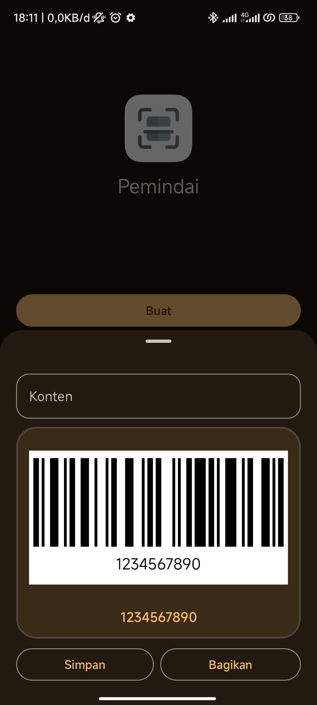

## Scanner

Android qr and barcode scanner application using [ZXing](https://github.com/zxing/zxing)

## Feature

- Create
- [x] Create QR/Barcode
- [x] Custom logo (QR)
- [x] Custom text (Barcode)
- [x] Custom QR/Barcode color
- Scan
- [x] Scan QR/Barcode
- [x] Scan fullscreen
- [ ] Scan only in viewfinder

## Sample

Download sample app on [Playstore](https://play.google.com/store/apps/details?id=otang.app.scanner)

## Screenshot

|  Home    |  Scan      |  Result   |  QR |
|--------------------------------------------------------------------|----------------------------------------------------------------------|---------------------------------------------------------------------|---------------------------------------------------------------|
|  Barcode |   Settings |  Settings |                                                               |

## Inspiration

- [zxing](https://github.com/zxing/zxing) for library and android implementation
- [code-scanner](https://github.com/yuriy-budiyev/code-scanner) for viewfinder view reference
- [zxing-lite](https://github.com/jenly1314/ZXingLite) for adding logo implementation